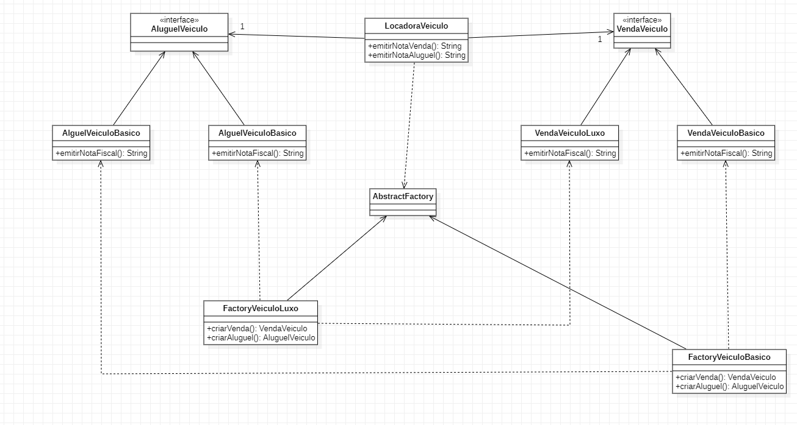

# Padrões de Projeto

## 1. Padrões de Criação:
___
### 1.3 Abstract Factory

#### 1.3.1 Introdução

#### 1.1.2 Exemplo abordado
Como exemplo para implementação deste padrão, foi abordado o seu uso em uma locadora de veículos, a qual dispõe de venda e aluguel de veículos.
#### 1.1.3 Diagrama de Classe do Exemplo

